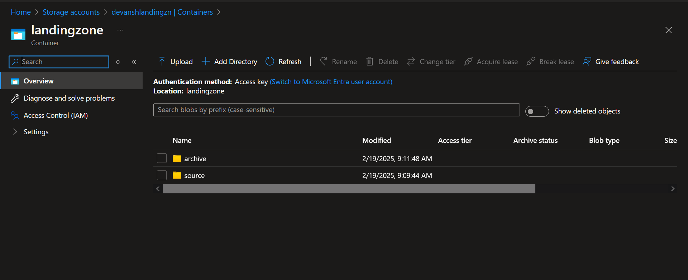
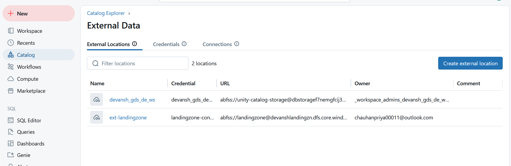
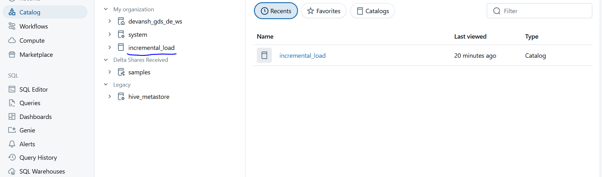

# Order Tracking Event-Driven Data Ingestion

## Project Overview

This project demonstrates an event-driven data ingestion pipeline using **PySpark on Databricks**. It implements an **incremental load with SCD Type 1 merge** to track order status changes efficiently.

## Technologies Used

- **Azure Data Lake Storage (ADLS)**
- **PySpark**
- **Databricks**
- **Delta Lake**
- **Databricks Workflows**


## Architecture Diagram

                                                                                                                   +---------+

---

## Implementation Details

### **1. Data Sources**

- Data is incrementally ingested into **Azure Data Lake Storage (ADLS)**.
- Source files are stored in a structured manner.

### **2. Data Transformation Steps**

1. **Reading Data:**
   - PySpark reads the raw data from ADLS and stores it in a **stage Delta table**.
2. **Archiving Data:**
   - After writing data to the stage table, the file is moved to an **archive folder**.
3. **Merging Data:**
   - A **target table** is created that copies data from the stage table.
   - **SCD Type 1 Merge** is performed using PySpark to keep the latest records.

---

## **Project Workflow**

### **Step 1: Setup Azure Resources**

- Create a **resource group** and **Databricks workspace**.
- Set up **Azure Data Lake Storage (ADLS)**.
- Create **containers** and folders for **source** and **archive** data.
- Configure **external location** and catalog.







### **Step 2: Data Ingestion**

- Read **CSV files** from the source directory in ADLS using PySpark.
- Write the data into a **Delta table (orders_stage)** in the landing zone.

```python
source_dir = "abfss://landingzone@devanshlandingzn.dfs.core.windows.net/source/"
target_dir = "abfss://landingzone@devanshlandingzn.dfs.core.windows.net/archive/"
stage_table = "incremental_load.default.orders_stage"

df = spark.read.csv(source_dir, header=True, inferSchema=True)
df.write.format("delta").mode("overwrite").saveAsTable(stage_table)
```

### **Step 3: Data Archiving**

- Move processed files from **source** to **archive** after ingestion.

```python
files = dbutils.fs.ls(source_dir)
for file in files:
    src_path = file.path
    target_path = target_dir + src_path.split("/")[-1]
    dbutils.fs.mv(src_path, target_path)
```

### **Step 4: Data Processing & Merge (SCD Type 1)**

- If the **target table does not exist**, create it.
- Otherwise, perform a **merge operation** on the **tracking_num** column.

```python
from delta.tables import DeltaTable

stage_df = spark.read.table("incremental_load.default.orders_stage")
target_table_name = "incremental_load.default.orders_target"

if not spark._jsparkSession.catalog().tableExists(target_table_name):
    stage_df.write.format("delta").saveAsTable(target_table_name)
else:
    target_table = DeltaTable.forName(spark, target_table_name)
    merge_condition = "stage.tracking_num = target.tracking_num"
    
    target_table.alias("target") \ 
        .merge(stage_df.alias("stage"), merge_condition) \ 
        .whenMatchedDelete() \ 
        .execute()
    
    stage_df.write.format("delta").mode("append").saveAsTable(target_table_name)
```

### **Step 5: Automating with Databricks Workflows**

- **Create a workflow** named `orders_tracking_incremental_load`.
- **Add tasks:**
  - `stage_load` (reads & stores raw data in stage table).
  - `target_load` (merges data into target table using SCD Type 1).
- **Trigger Configuration:**
  - File arrival at ADLS storage triggers the workflow.

```json
{
  "name": "orders_tracking_incremental_load",
  "tasks": [
    { "task_key": "stage_load", "notebook_path": "orders_stage_load" },
    { "task_key": "target_load", "depends_on": ["stage_load"], "notebook_path": "orders_target_load" }
  ],
  "trigger": { "file_arrival": { "url": "abfss://landingzone@devanshlandingzn.dfs.core.windows.net/source/" } }
}
```

---

## **How to Run the Project**

1. Clone the repository and configure your **Databricks workspace**.
2. Upload data files to the **staging zone** in ADLS (`source/` folder).
3. Workflow will trigger automatically, executing **data ingestion & transformation**.
4. Validate data in **orders_target table** after execution.

---

## **Project Folder Structure**

```
├── notebooks/            # Databricks Notebooks
│   ├── orders_stage_load.ipynb
│   ├── orders_target_load.ipynb
│
├── data/                 # Sample datasets
│   ├── order_tracking_2023_01_01.csv
│
│
├── README.md             # Main documentation
```

---

## **Future Enhancements**

- Implement **SCD Type 2** for historical tracking.
- Optimize **merge operations** using partitioning strategies.
- Automate **CI/CD deployment** using **Databricks Repos & GitHub Actions**.

---

## **Contact**

For queries or contributions, contact [Your Name] at [Your Email].
